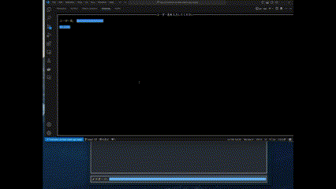

# CLI-Chat-Client
- CLIで動作するチャットアプリ
- [CLI-Chat-Server](https://github.com/ChikaKakazu/CLI-Chat-Server)も動作する必要がある

## 起動
1. dockerコンテナを起動する
    ```
    docker-compose up -d
    ```
2. Server側のdockerコンテナを起動する
3. コンテナ内で実行コマンドを叩く
   `go run main.go`

## .protoファイルからコード自動生成
- 生成済みなので必要ないがメモとして残す
- `chat_room.proto`は適宜変更
```
protoc --go_out=./pb/  --go-grpc_out=require_unimplemented_servers=false:./pb/ api/chat_room.proto
```
